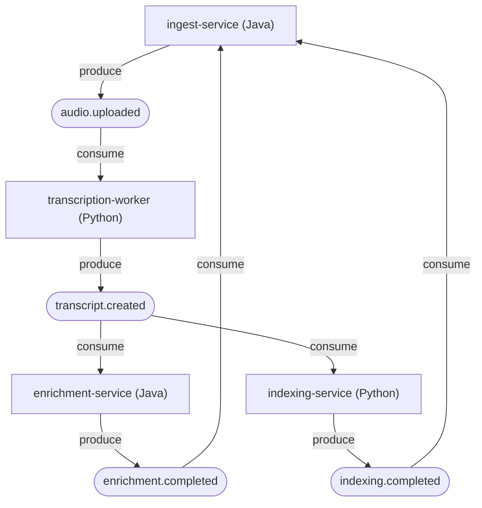

# Contrato de eventos

Contrato compartido del pipeline, materializado en esquemas Avro versionados en `schemas/avro/` y registrado en Schema Registry. Es la frontera que mantiene sincronizados los servicios Java y Python: un productor Java y un consumidor Python hablan el mismo esquema sin desincronizacion.

## Topologia

`transcript.created` hace fan-out a dos consumidores independientes
(`enrichment-service` e `indexing-service`) que procesan en paralelo.

Coordinacion por coreografia: cada servicio escucha y emite; no hay orquestador central. `ingest-service` mantiene un agregador de estado liviano consumiendo los eventos terminales.

## Eventos

| Topic                  | Esquema                          | Produce               | Consume                                  |
|------------------------|----------------------------------|-----------------------|------------------------------------------|
| `audio.uploaded`       | `AudioUploaded`                  | ingest-service        | transcription-worker                     |
| `transcript.created`   | `TranscriptCreated`              | transcription-worker  | enrichment-service, indexing-service     |
| `enrichment.completed` | `EnrichmentCompleted`            | enrichment-service    | ingest-service (estado)                  |
| `indexing.completed`   | `IndexingCompleted`              | indexing-service      | ingest-service (estado)                  |

## Convenciones transversales

Todos los eventos comparten tres campos de cabecera:

- `event_id` (uuid): identificador unico del evento.
- `job_id` (uuid): identificador del job. Es la columna vertebral de la correlacion y, junto a la etapa, la **clave de idempotencia**.
- `occurred_at` (timestamp-millis, UTC): instante de emision.

Reglas:

- **Referencias, nunca binario.** El audio vive en object storage (MinIO). Los eventos cargan un `ObjectRef {bucket, key}`. El binario nunca entra a Kafka.
- **Idempotencia por `job_id` + etapa.** Cada consumidor verifica si ya proceso esa combinacion antes de trabajar; un evento reprocesado no duplica trabajo.
- **Timestamps siempre de Whisper.** Los tiempos por segmento y por palabra provienen del motor de transcripcion, jamas del LLM (que los alucina).

## Schema Registry

- **Subject naming**: `TopicNameStrategy`. El subject de cada topic es `<topic>-value` (p. ej. `transcript.created-value`).
- **Compatibilidad**: `BACKWARD` (default). Un consumidor con el esquema nuevo puede leer datos escritos con el esquema anterior. En la practica:
  - Anadir un campo requiere `default`.
  - Eliminar un campo solo es seguro si tenia `default`.
  - No se renombran campos (es eliminar + anadir).
- Los campos opcionales se modelan como union `["null", T]` con `"default": null`.

## Esquemas y ejemplos

- Definiciones: `schemas/avro/*.avsc`.
- Fixture validado: `schemas/examples/transcript-created.example.json`, generado a partir de una transcripcion real y verificado con un round-trip de serializacion/deserializacion Avro (8992 bytes binarios para 80 s de audio con 185 palabras y sus timestamps). Sirve de fixture para los servicios consumidores y sus tests.

## Notas de evolucion

- **Diarizacion** (extension): anadira hablante a `Segment` y/o `Word`, y dejara de inferir el `assignee` de los action items para usar el hablante real. Campos nuevos con `default null` para mantener compatibilidad BACKWARD.
- **Versionado de embeddings**: `IndexingCompleted.embedding_model_version` habilita el reprocesamiento masivo al cambiar de modelo sin perder el indice.
